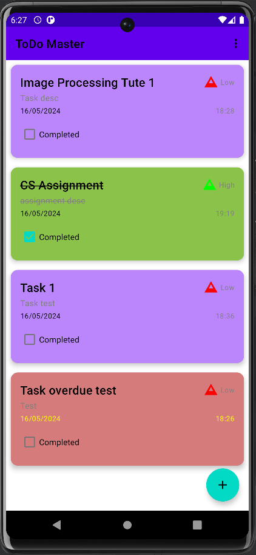

# ToDo Master

ToDo Master is an Android application for managing tasks. Users can add, update, delete, and set reminders for tasks. The app supports dark mode and stores data in Firebase Firestore.

## Features

- Add, update, and delete tasks
- Set reminders for tasks
- Priority-based task sorting
- Swipe-to-complete or delete tasks
- Dark mode support
- Authentication using Firebase

## Screenshots

### Splash Screen


### Main Screen


### Add Task


### Dark Mode


### Settings


## Getting Started

### Prerequisites

- Android Studio
- Firebase account

### Installation

1. **Clone the repository:**
   ```sh
   git clone [https://github.com/yourusername/todomaster.git](https://github.com/IamMalinga/ToDO-Mobile-App-.git)
   cd ToDO-Mobile-App-
